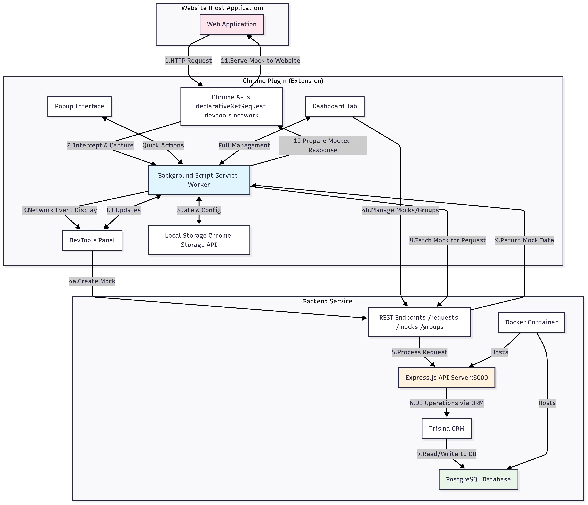

# Mockey Patcher - API Request Mocking System

A comprehensive Chrome extension with backend service for intelligent API request mocking, real-time network monitoring, and seamless development workflows.

## 🏁 Getting Started Checklist

1. **Set up the backend**
   - Install Docker and Docker Compose
   - Download the [docker-compose.public.yml](https://github.com/shivarajbakale/mockey-patcher/releases/download/v1.0.0/docker-compose.public.yml) file from the Releases page
   - Create a new directory for the project and place the downloaded file in it
   - Set the environment variables:
     ```
     export BACKEND_PORT=3000
     export POSTGRES_PORT=5432
     ```
   - Navigate to the directory containing the docker-compose file and run:
     ```
     docker-compose -f docker-compose.public.yml up -d
     ```
   - Verify backend is running at http://localhost:3000

2. **Install the Chrome Extension**
   - Download the extension [chrome-mv3-prod.zip](https://github.com/shivarajbakale/mockey-patcher/releases/download/v1.0.0/chrome-mv3-prod.zip) from the Releases page
   - Open Chrome and go to `chrome://extensions`
   - Enable "Developer mode"
   - Drag and drop the downloaded .zip file into the extensions page
   - Verify the extension icon appears in your toolbar

3. **Configure the extension**
   - Click the extension icon
   - Set backend URL to http://localhost:3000
   - Create your first mock or rule group

4. **Start using the extension**
   - Open Chrome DevTools
   - Navigate to the "Mockey Patcher" panel
   - Begin tracking and mocking API requests

## 🌐 Project Website

Visit our [GitHub Pages site](https://shivarajbakale.github.io/mockey-patcher/) for more information about Mockey Patcher, including:
- Detailed feature overview
- System architecture diagrams
- Installation instructions
- Privacy policy

## 🏗️ How It Works


## 🏛️ Technical Architecture



## 📋 Core Components

### Chrome Extension (`packages/chrome/`)
- **Background Script**: Manages Chrome APIs and message routing
- **DevTools Panel**: Real-time network monitoring and request capture
- **Dashboard Tab**: Full-featured interface for managing mocks and groups

### Backend Service (`packages/backend/`)
- **REST API**: Node.js/Express server for data management
- **Database**: PostgreSQL with Prisma ORM
- **CLI Tools**: Command-line interface for service management
- **Docker Setup**: Containerized deployment

## 🔄 Workflow

1. **Capture**: Extension monitors network requests in DevTools
2. **Store**: Requests are saved to PostgreSQL database via REST API
3. **Mock**: Create mock responses for captured requests
4. **Group**: Organize related requests into logical groups
5. **Activate**: Enable/disable mocks using Chrome's redirect rules
6. **Intercept**: Chrome redirects matching requests to mock responses

## 📦 What Gets Started

After running `yarn setup`:

- **Backend API**: `http://localhost:3000`
- **PostgreSQL Database**: `localhost:5432`
  - Email: `admin@admin.com`
  - Password: `admin`
- **Chrome Extension**: Build available in `packages/chrome/build/`

## 🏗️ Project Structure

```
redirector-app/
├── packages/
│   ├── chrome/          # Chrome extension (Git submodule)
│   └── backend/         # Node.js backend (Git submodule)
├── scripts/             # Setup and start scripts
└── package.json         # Root workspace configuration
```

## 🔧 Available Scripts

### Docker Commands (Recommended)
- `yarn start:docker` - Start all services in Docker containers
- `yarn logs` - View backend container logs
- `yarn down` - Stop all Docker containers

### Local Development
- `yarn setup` - Complete setup with submodules
- `yarn start` - Start with local backend
- `yarn dev` - Development mode
- `yarn build` - Build all packages

### Submodule Management
- `yarn submodule:init` - Initialize submodules
- `yarn submodule:update` - Update submodules to latest
- `yarn submodule:pull` - Pull latest changes

## 🛠️ Tech Stack

- **Frontend**: React 18, TypeScript, Tailwind CSS
- **Backend**: Node.js, Express, Prisma ORM
- **Database**: PostgreSQL
- **Infrastructure**: Docker, Docker Compose
- **State Management**: Zustand
- **UI Components**: Radix UI, Shadcn/ui

## 🎯 Key Features

- **Real-time Network Monitoring**: Capture HTTP requests in DevTools
- **Intelligent Mocking**: Create and manage mock responses
- **Group Management**: Organize requests into logical groups
- **Volatile Parameter Handling**: Smart URL pattern matching
- **Persistent Storage**: PostgreSQL database with full CRUD operations
- **Context Menu Integration**: Quick access from any page
- **CLI Management**: Command-line tools for service control

## 🐛 Troubleshooting

**Docker Issues:**
- Ensure Docker is running: `yarn down` then `yarn start:docker`
- Check logs: `yarn logs`

**Submodule Issues:**
- Empty submodules: `yarn submodule:init`
- Outdated submodules: `yarn submodule:update`

**Database Issues:**
- Ensure port 5432 is available

## 👨‍💻 Author

**Shivaraj Bakale** - shivarajapple@gmail.com
